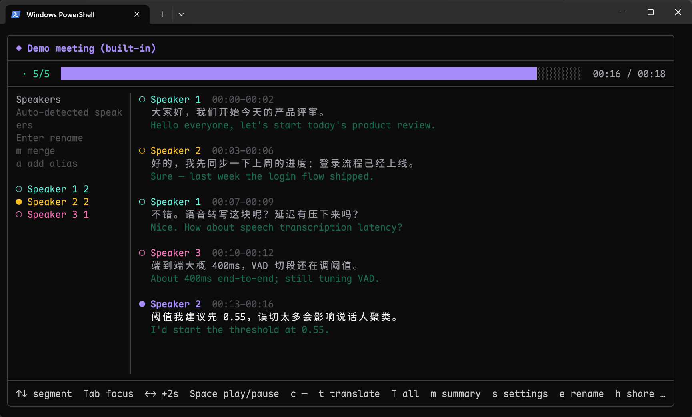
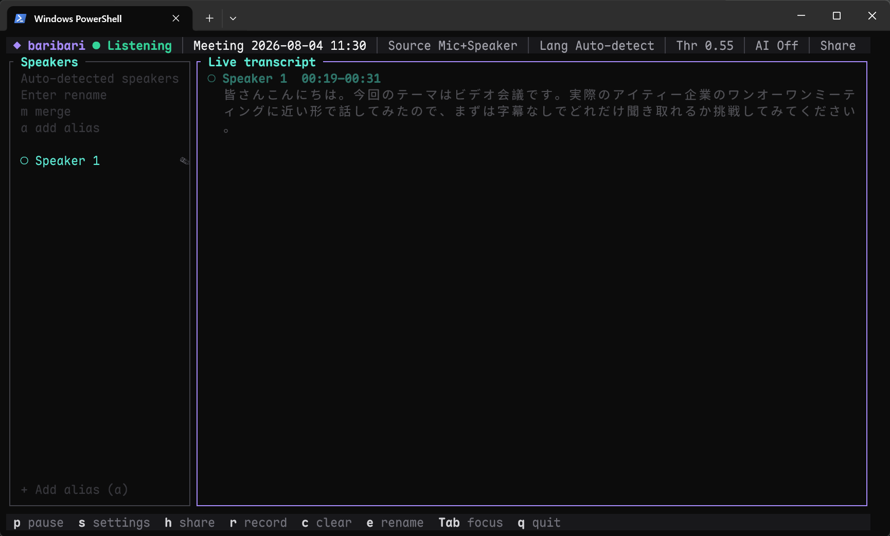
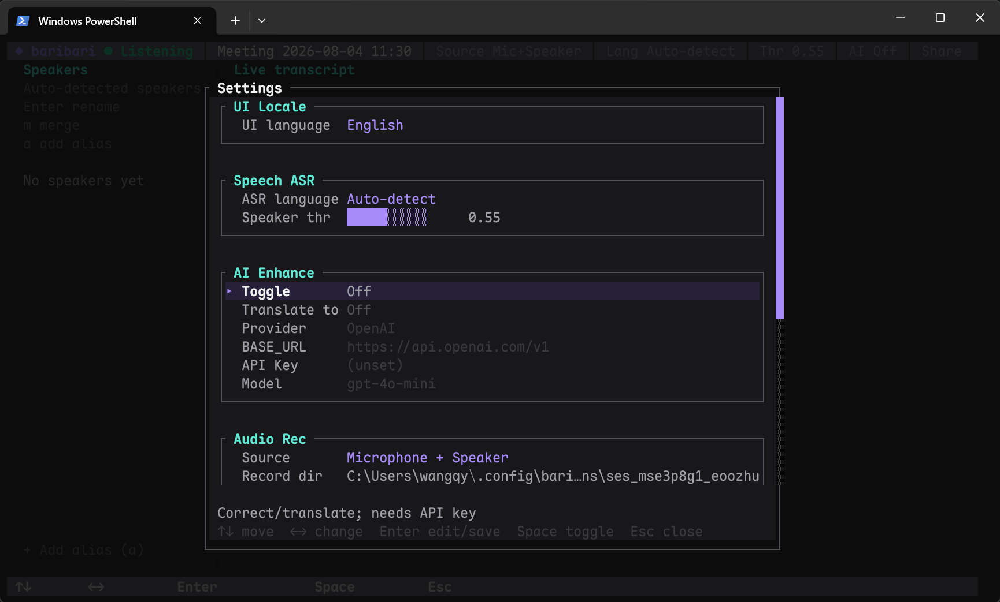
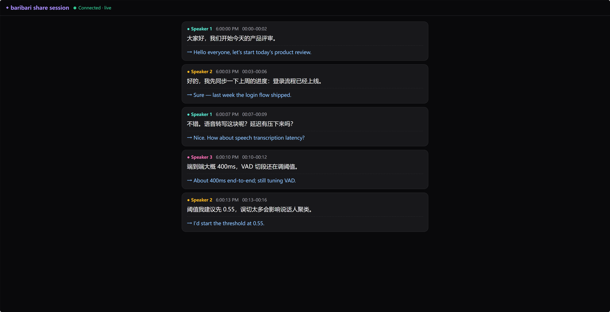

<div align="center">

# baribari

**ターミナルで会議をリアルタイム文字起こし**

SenseVoice · Silero VAD · 話者識別 · AI 校正/翻訳 · LAN 共有



[](https://www.npmjs.com/package/baribari)
[](https://nodejs.org)
[](./LICENSE)

[English](./README.md) · [中文](./README.zh.md) · **日本語**

[ドキュメント](https://qinyangwang.github.io/baribari/) · [設計 docs](./docs/)

**Bash**

```bash
npm i -g baribari && baribari setup --download && baribari
```

**PowerShell**

```powershell
npm i -g baribari; baribari setup --download; baribari
```

**CMD**

```bat
npm i -g baribari & baribari setup --download & baribari
```

</div>

---

## なぜ baribari？

| 機能 | 内容 |
|------|------|
| **会議向け TUI** | 話者、リアルタイム文字起こし、デバイス、録音、共有状態を一画面に表示 |
| **ローカル音声認識** | SenseVoice、Fun-ASR-Nano、日本語特化 ReazonSpeech を選択可能。すべて Silero VAD とともにローカルで動作 |
| **話者ラベル** | 声紋で話者を区別し、グローバル名簿で頻繁に会う参加者を次回から自動照合 |
| **任意の AI 機能** | OpenAI 互換 API を使った校正、翻訳、要約と、主要サービスの Provider プリセット |
| **セッションの自動保存** | `resume` で再生、続行録音、翻訳、要約、再共有 |
| **LAN 共有** | 1 台の PC が文字起こしを行い、ほかの参加者はブラウザや CLI から字幕を確認 |
| **ローカル保存** | 設定、モデル、セッションを既定で `~/.config/baribari` に保存 |

---

## 画面イメージ

| ライブ文字起こし | 設定 |
|:---:|:---:|
|  |  |
| **Demo・再生モード** | **Web 共有** |
|  |  |

---

## 目次

- [インストール](#インストール)
- [クイックスタート](#クイックスタート)
- [CLI](#cli)
- [TUI キー](#tui-キー)
- [設定](#設定)
- [モデル](#モデル)
- [AI](#ai)
- [LAN 共有](#lan-共有)
- [開発](#開発)
- [ライセンス](#ライセンス)

---

## インストール

**動作要件:** Node.js **≥ 18**。**Windows** では、マイクとシステム音声を含む最も完全な音声収録を利用できます。Linux/macOS は主にマイク収録に対応し、利用可否は `node-cpal` に依存します。

```bash
npm install -g baribari
```

ソースから:

```bash
git clone https://github.com/QinYangWang/baribari.git
cd baribari
npm install
npm run build
npm link
```

> **シェル:** つなげるときは bash/zsh/fish は `&&`、PowerShell は `;`、cmd は `&`。下の複数行はそのまま使えます。

---

## クイックスタート

```bash
# 初回のみ：表示言語と認識モデルを選んでダウンロード
baribari setup --download

# リアルタイム文字起こしを開始
baribari

# 問題がある場合は動作環境を診断
baribari doctor
```

セットアップでは SenseVoice、Fun-ASR-Nano、ReazonSpeech、または3つすべてを選べます。推奨の既定は
SenseVoice です。1 つだけ選んだ場合は、そのモデルが現在の認識モデルになります。

---

## CLI

```text
baribari [options]               ライブ転写（既定）
baribari setup [options]         モデル確認/DL
baribari paths | config          パス表示
baribari devices                 マイク一覧
baribari doctor                  動作環境を確認・診断
baribari session list            保存セッション一覧
baribari session rm <id>         セッション削除
baribari resume [id]             セッションを閲覧・再生（既定: demo）
baribari demo                    baribari resume demo と同じ
baribari join <url>              LAN 共有に参加（受信のみ）
baribari completion [shell]      bash | zsh | fish | powershell
baribari -h | -V                 ヘルプ / バージョン
```

### セッション

ライブ文字起こしは `~/.config/baribari/sessions/<id>/` に自動保存されます。字幕は JSONL ファイルに記録され、`r` で録音を開始すると音声が `audio.wav` に保存されます。

```bash
baribari session list
baribari session rm ses_完全なid        # 確認のため id を再入力
baribari session rm ses_xxx -y
baribari session rm ses_ab --allow-prefix
baribari resume demo
baribari resume ses_xxxx
```

既定では、削除時に**完全なセッション ID**を指定し、同じ ID を再入力して確認する必要があります。

**再生キー（ライブと別・フッターと一致）:**

| キー | 動作 |
|------|------|
| `↑` `↓` | 前/次の字幕（再生位置も移動） |
| `←` `→` | タイムライン −2s / +2s |
| `Space` / `p` | 再生/一時停止（音声は `ffplay` 推奨） |
| `c` | **同一セッションで続行**（demo 不可） |
| `t` / `T` | 現在行を翻訳 / 未翻訳を一括 |
| `m` | 会議要約（字幕） / **話者統合**（話者パネル） |
| 統合モード | すべて `○` · `Space` で `→` · `Esc` → `y` 保存 / `n` 破棄 |
| `s` | 設定（中: `↑↓` 移動 `←→` 変更 `Esc` 閉じる） |
| `e` | 改名 |
| `h` | LAN 共有 ON/OFF（終了しない） |
| `q` | 終了 |

Resume モードでは、ライブ文字起こし用の `r` 録音、`Tab` による領域切り替え、`1–9` による話者割り当ては使用できません。

`audio-part-*.wav` と `audio.wav` は、形式が一致する場合に可能な限り結合されます。Resume モードは `baribari resume demo` で試せます。

| 主なオプション | 説明 |
|-----------------|------|
| `--lang` | 認識 `auto\|zh\|en\|ja\|ko\|yue` |
| `--ui-lang` | 表示 `zh\|ja\|en` |
| `--source` | `mic\|loopback\|both` |
| `--ai` / `--no-ai` | AI 強化 |
| `--ai-correct` / `--no-ai-correct` | AI 校正（翻訳と独立） |
| `--ai-translate` | 翻訳先 |
| `--share` / `join` | LAN 共有 |
| `--vad-min-silence` | 無音で切る秒数（小さいほど頻繁） |
| `--vad-max-speech` | 1 区間の最大長（強制切断） |

```bash
eval "$(baribari completion bash)"
```

詳細は [English README](./README.md) を参照。

---

## グローバル話者名簿

声紋と表示名:

```text
~/.config/baribari/speakers/roster.json
```

- ライブ開始時に名簿をスロット `1…G` として読み込み
- TUI 話者リスト（`Tab`）→ 自動検出話者を **Enter で改名** → 名簿に保存
- 以降の会議で声が一致すれば自動ラベル；終了時に EMA 更新して書き戻し
- 不要なら `--no-spk`

---

## TUI キー

| キー | 動作 |
|------|------|
| `p` / `Space` | 一時停止 / 再開 |
| `s` | 設定（スクロール可能なグループ） |
| `h` | LAN 共有 ON/OFF |
| `r` | 録音 → セッション `audio.wav` |
| `c` | 画面上の転写をクリア（ファイルは消さない） |
| `Tab` | フォーカス: 話者 ↔ 転写 |
| `1`–`9` | 直前セグメントを話者 *N* に割当（話者フォーカス時） |
| `m` | **話者統合**（話者リスト: 元 → 先 → Enter） |
| `e` | セッション名の変更 |
| `↑` `↓` / ホイール | 転写スクロール（上=古い；`g` でライブ末尾へ） |
| `q` | 終了 |

**レイアウト：** 話者 · リアルタイム転写 · デバイス / 録音 / 共有  
**Live vs final：** 転写欄の最下段に更新可能な **live 行**。現在の VAD 区間を SenseVoice がデコード中は状態表示（例:「認識中…」、偽トークンなし）。エンドポイント後に live は消え **final** が履歴へ。セッション・LAN 共有・AI は **final のみ**。

（内部は VAD + オフライン SenseVoice。逐語オンライン ASR ではない。）

**設定：** 認識、AI（翻訳先・Provider プリセット）、音声、共有、VAD プリセット、表示言語。

---

## 設定

```text
~/.config/baribari/
├── config.json
├── replace.json     # ローカル辞書（AI なし、初回に例を生成）
├── models/
├── sessions/
├── speakers/        # グローバル名簿 roster.json
└── recordings/
```

初回 UI 言語: `1) 中文` · `2) 日本語` · `3) English (default)`。Enter のみは **English（3）**。番号は画面の並びと一致。

**VAD プリセット:** バランス（既定）· 会議（複数話者向け・推奨）· 低遅延 · なめらか · 積極。低遅延では、SenseVoice は約 `0.22秒`、Fun-ASR-Nano は約 `0.28秒` の無音で final を確定します。Nano では文脈を保つため、少し長い発話区間を使います。

**同一話者ターン結合（`speakerTurn`）:** 短い VAD 断片を同話者なら最大 3 個まで結合してから AI。詳細は [docs/asr-pipeline.md](./docs/asr-pipeline.md)。

**ローカル整形（AI 不要）：** ASR と同話者結合のあと、任意 AI の前に句読点整理と `replace.json`。`{ "replacements":[…] }` または `{ "誤":"正" }`。mtime でホットリロード。

環境変数: `BARIBARI_CONFIG_DIR` · `BARIBARI_UI_LANG` · `BARIBARI_AI_KEY` / `OPENAI_API_KEY` · `BARIBARI_NO_UPDATE_CHECK=1`。npm の最新版は起動時にバックグラウンドで1回だけ確認し、ネットワークエラーも表示しません。

---

## モデル

既定は SenseVoice です。**設定 → Speech ASR → ASRモデル** で `←` / `→` を
押すと SenseVoice、Fun-ASR-Nano、ReazonSpeech（日本語特化、約 162 MB）を切り替えられます。
未インストールの場合はダウンロード確認が表示されます。その場で待つか、バックグラウンドで取得し
ながら文字起こしを続けるかを選べます。ワイド表示では右の詳細欄に取得段階と進捗が
表示され、成功したあとにモデルが切り替わります。
`baribari --asr-engine reazonspeech-ja` で日本語モデルを直接起動することもできます。

```bash
baribari setup --download
baribari paths
```

---

## AI

```bash
export BARIBARI_AI_KEY=sk-...
baribari --ai --ai-translate en --ai-model gpt-4o-mini
```

OpenAI 互換 Chat Completions。原文と訳文は別行。TUI **設定 → AI → Provider** で OpenAI / Gemini / DeepSeek などのプリセットを切替。詳細は English README。

---

## LAN 共有

```bash
baribari --share
baribari join http://192.168.x.x:8787/
```

---

## ドキュメントサイト

設計メモは [`docs/`](./docs/)。GitHub Pages（VitePress）:

```bash
npm run docs:dev
npm run docs:build
```

**Settings → Pages → Source: GitHub Actions** を有効化後:

`https://qinyangwang.github.io/baribari/`

---

## 開発

```bash
npm install
npm run hooks:install    # pre-commit: typecheck + check:i18n
npm run typecheck
npm run check:i18n       # locale キー一致 (zh/ja/en)
npm run precommit
npm run docs:dev
npm run dev -- --demo
```

公開: `package.json` と同じ `v*` タグ（例 `v1.5.0`）を push → Actions → npm。

---

## ライセンス

[MIT](./LICENSE)

<div align="center">

[npm](https://www.npmjs.com/package/baribari) · [Issues](https://github.com/QinYangWang/baribari/issues)

</div>
